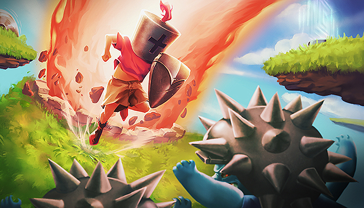
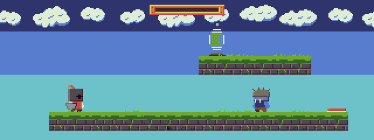
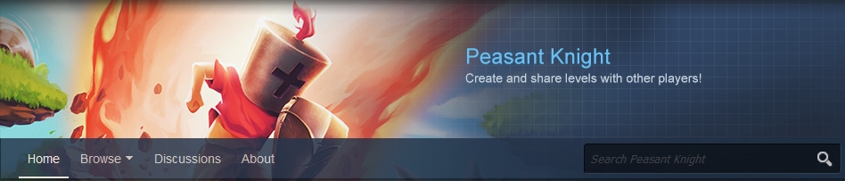

Peasant Knight is a challenging puzzle-platformer that you can play with two keys: jump and stop. The rest of the time you're relentlessly dashing forward into traps, enemies, and hazards in general. Peasant Knight has a tongue-in-cheek tone that fits well the many ways to reach your demise.

[Mention release date here]

[Try the demo!](http://insertlink.todo)

## Content:
### 18 traps, enemies, and bosses to overcome

### 100+ levels to solve

### Local multiplayer
Up to 4 players. Coop and race modes.

### Steam Workshop level editing and sharing

